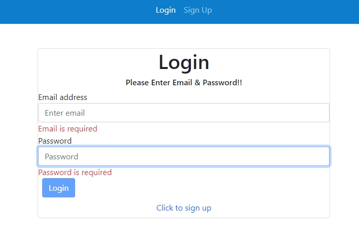
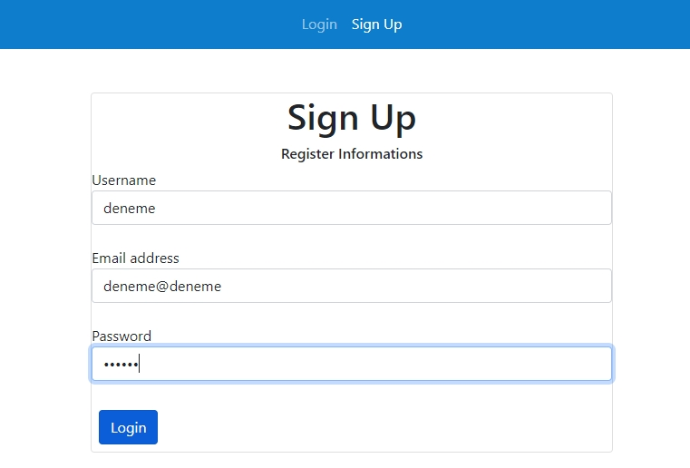
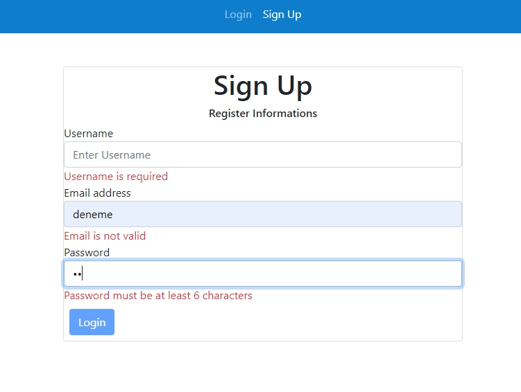

<h2>Login-Register</h2>

Vserion 1 (14.03.2022)

-Login, signup components with reactive form and hompeage component
-Basic default validations
-Authentication with fake JSON api and Http Client Module

Version 2 (27.03.2022)

-Guard added with using local storage data
-3 type of validation used(pattern with regex, custom abstract control validator, custom external validator

