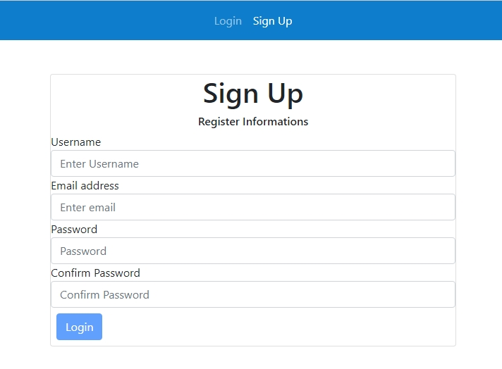

<h2>Login-Register</h2>

Version 2 (27.03.2022) 

-Guard added with using local storage data 
-3 type of validation used(pattern with regex, custom abstract control validator, custom external validator 
-Confirm password added with match checking 

Version 1 (14.03.2022) 

-Login, signup components with reactive form and hompeage component 
-Basic default validations 
-Authentication with fake JSON api and Http Client Module 

